<picture>
  <source media="(prefers-color-scheme: dark)" srcset="https://raw.githubusercontent.com/TECHGAMESPI/TECHGAMESPI/main/dark.svg">
  <source media="(prefers-color-scheme: light)" srcset="https://raw.githubusercontent.com/TECHGAMESPI/TECHGAMESPI/main/light.svg">
  
</picture>

### Oiii, eu sou o **Cândido** 👋
Engenheiro de Software, pós-graduado em Cybersecurity e criador de conteúdo de tecnologia no YouTube.
Mantenho a **TECHGAMESPI** e desenvolvo projetos como a **Javis Academy**.

 

  
  

<!-- Esses dois cards são gerados pela GitHub Action em .github/workflows/readme-stats.yml
     (stats-organization/github-readme-stats-action), não pelo serviço público do Vercel. -->

 

### 🛠️ Stack

 

### 🔗 Onde me encontrar

